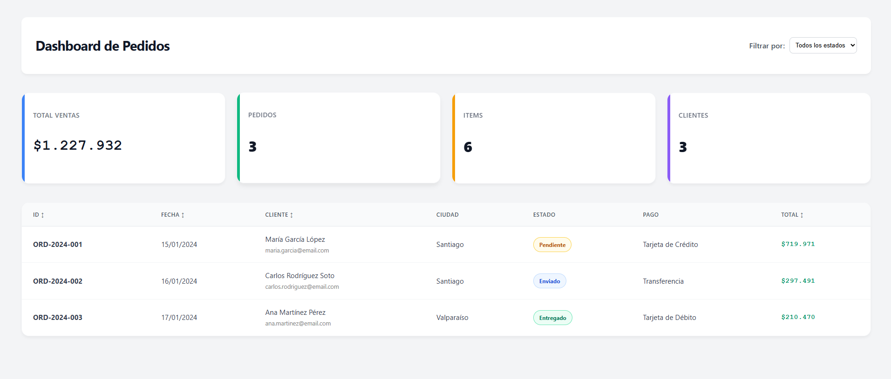
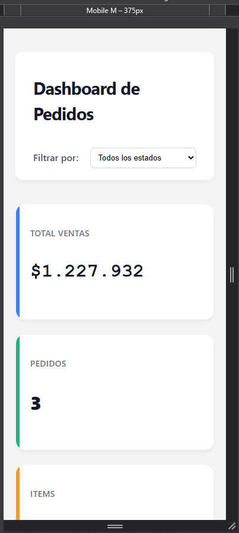
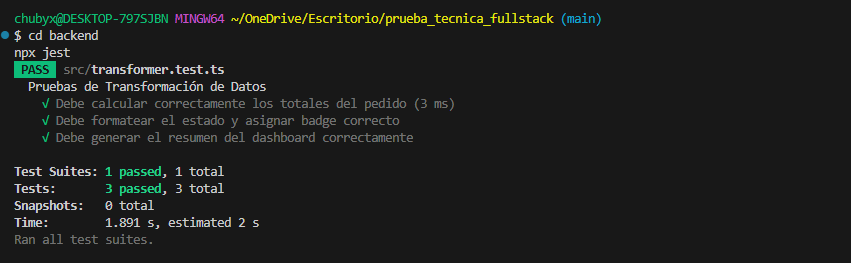

# 🚀 Dashboard de Pedidos - Prueba Técnica Full Stack

 Solución integral para la transformación, visualización y gestión de pedidos provenientes de sistemas legacy, presentada en una interfaz moderna y responsiva.


# 📋 Descripción del Proyecto

Este proyecto consiste en una aplicación Full Stack que consume datos en formato JSON (simulando un sistema legacy), los procesa mediante un algoritmo de normalización en el backend y los expone a través de una API REST. El frontend consume esta data para mostrar un dashboard interactivo con métricas clave de negocio.

El objetivo principal fue asegurar la integridad de los datos financieros (cálculo preciso de montos y descuentos) y ofrecer una experiencia de usuario fluida tanto en escritorio como en dispositivos móviles.

# 🛠️ Stack Tecnológico

- Backend

- Runtime: Node.js

- Framework: Express

- Lenguaje: TypeScript

- Testing: Jest (Tests Unitarios)

- Herramientas: ts-node, cors

- Frontend

- Framework: React

- Build Tool: Vite

- Lenguaje: TypeScript

- Estilos: CSS Modules (Diseño Responsive & Custom Badges)

# ✨ Características y Bonus Implementados

El proyecto cumple con el 100% de los requerimientos base y todos los puntos opcionales propuestos:

- ✅ Transformación ETL Robusta: Lógica separada y testeable para limpiar y normalizar datos.

- ✅ Dashboard Interactivo: Tarjetas de KPI (Ventas Totales, Pedidos, Clientes Únicos).

- ✅ Filtros y Ordenamiento: Filtrado por estado del pedido y ordenamiento dinámico por columnas.

- ✅ Diseño Responsive: Adaptación total a móviles, transformando la tabla en una vista de "Tarjetas" para mejor legibilidad.

- ✅ Tests Unitarios: Verificación automática de la lógica de negocio con Jest.

- ✅ UX: Feedback visual de carga (Loading states) y manejo elegante de errores.

  



# 🗂️ Estructura del Proyecto


El repositorio está organizado como un Monorepo simple para facilitar la revisión:

```bash
prueba_tecnica_fullstack/
├── backend/                    # API REST y lógica de negocio
│   ├── src/
│   │   ├── index.ts            # Entry point del servidor Express
│   │   ├── transformer.ts      # Lógica ETL (núcleo de la prueba)
│   │   ├── types.ts            # Tipos y interfaces TypeScript
│   │   └── data.json           # Fuente de datos del sistema legacy
│   ├── tests/
│   │   └── transformer.test.ts # Tests unitarios de la transformación
│   ├── package.json            # Dependencias y scripts
│   └── ...
├── frontend/                   # Cliente React (Dashboard)
│   ├── src/
│   │   ├── components/         # Componentes reutilizables
│   │   ├── styles/             # CSS Modules y estilos
│   │   ├── App.tsx             # Componente raíz
│   │   └── ...
├── screenshots/                # Capturas de pantalla para documentación
└── README.md
```


# 🚀 Instrucciones de Instalación

#### Requisitos previos: Node.js v16+ y npm.

### 1. Backend (API)

#### Abre una terminal y navega a la carpeta del backend:

- cd backend
- npm install
##### Ejecutar servidor
- npx ts-node src/index.ts
- El servidor iniciará en: http://localhost:3001


### 2. Frontend (Cliente)

#### En una segunda terminal, navega a la carpeta del frontend:

- cd frontend
- npm install
##### Ejecutar aplicación
- npm run dev
- La aplicación estará disponible en: http://localhost:5173


# 🧪 Testing

Se implementaron pruebas unitarias en el backend para garantizar que la transformación de datos sea matemáticamente correcta (cálculos de totales, formateo de fechas y asignación de estados).

Para ejecutar las pruebas:

- cd backend
- npx jest

  



# 📝 Notas Adicionales y Decisiones de Diseño

1. Persistencia de Datos: La aplicación asume que el archivo data.json existe en backend/src/.

2. Estilos: Se utilizó CSS puro con CSS Modules, variables y Media Queries. Esto se hizo para demostrar dominio de maquetación y fundamentos de CSS sin depender de librerías de componentes pesadas (como Material UI o Bootstrap).

3. Manejo de Moneda: El sistema implementa redondeos aritméticos específicos para asegurar la precisión en moneda CLP (Pesos Chilenos).
